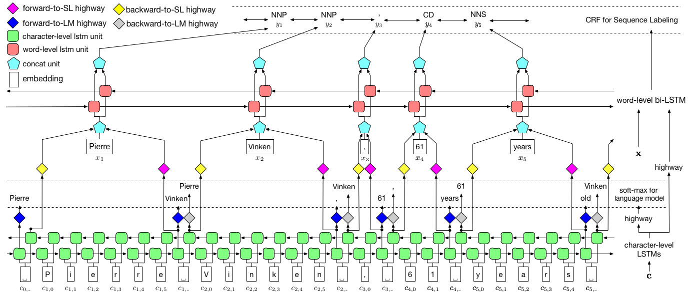

# LM-LSTM-CRF 

[](http://lm-lstm-crf.readthedocs.io/en/latest/?badge=latest)
[](https://opensource.org/licenses/Apache-2.0)
[](https://insight.io/github.com/LiyuanLucasLiu/LM-LSTM-CRF)

**Check Our New NER Toolkit🚀🚀🚀**
- **Inference**:
  - **[LightNER](https://github.com/LiyuanLucasLiu/LightNER)**: inference w. models pre-trained / trained w. *any* following tools, *efficiently*. 
- **Training**:
  - **[LD-Net](https://github.com/LiyuanLucasLiu/LD-Net)**: train NER models w. efficient contextualized representations.
  - **[VanillaNER](https://github.com/LiyuanLucasLiu/Vanilla_NER)**: train vanilla NER models w. pre-trained embedding.
- **Distant Training**:
  - **[AutoNER](https://shangjingbo1226.github.io/AutoNER/)**: train NER models w.o. line-by-line annotations and get competitive performance.

--------------------------------

This project provides high-performance character-aware sequence labeling tools, including [Training](#usage), [Evaluation](#evaluation) and [Prediction](#prediction). 

Details about LM-LSTM-CRF can be accessed [here](http://arxiv.org/abs/1709.04109), and the implementation is based on the PyTorch library. 

**Important:** A serious bug was found on the ```bioes_to_span``` function in the original implementation, please refer the numbers reported in the [Benchmarks](#benchmarks) section as the accurate performance.

The documents would be available [here](http://lm-lstm-crf.readthedocs.io/en/latest/).

## Quick Links

- [Model](#model-notes)
- [Installation](#installation)
- [Data](#data)
- [Usage](#usage)
- [Benchmarks](#benchmarks)
- [Pretrained model](#pretrained-model)

## Model Notes

<p align="center"></p>

As visualized above, we use conditional random field (CRF) to capture label dependencies, and adopt a hierarchical LSTM to leverage both char-level and word-level inputs. 
The char-level structure is further guided by a language model, while pre-trained word embeddings are leveraged in word-level.
The language model and the sequence labeling model are trained at the same time, and both make predictions at word-level.
[Highway networks]("https://arxiv.org/abs/1507.06228") are used to transform the output of char-level LSTM into different semantic spaces, and thus mediating these two tasks and allowing language model to empower sequence labeling.

## Installation

For training, a GPU is strongly recommended for speed. CPU is supported but training could be extremely slow.

### PyTorch

The code is based on PyTorch and **supports PyTorch 0.4 now** . You can find installation instructions [here](http://pytorch.org/).

### Dependencies

The code is written in Python 3.6. Its dependencies are summarized in the file ```requirements.txt```. You can install these dependencies like this:
```
pip3 install -r requirements.txt
```

## Data

We mainly focus on the CoNLL 2003 NER dataset, and the code takes its original format as input. 
However, due to the license issue, we are restricted to distribute this dataset.
You should be able to get it [here](http://aclweb.org/anthology/W03-0419).
You may also want to search online (e.g., Github), someone might release it accidentally.

### Format

We assume the corpus is formatted as same as the CoNLL 2003 NER dataset.
More specifically, **empty lines** are used as separators between sentences, and the separator between documents is a special line as below.
```
-DOCSTART- -X- -X- -X- O
```
Other lines contains words, labels and other fields. **Word** must be the **first** field, **label** mush be the **last**, and these fields are **separated by space**.
For example, the first several lines in the WSJ portion of the PTB POS tagging corpus should be like the following snippet.

```
-DOCSTART- -X- -X- -X- O

Pierre NNP
Vinken NNP
, ,
61 CD
years NNS
old JJ
, ,
will MD
join VB
the DT
board NN
as IN
a DT
nonexecutive JJ
director NN
Nov. NNP
29 CD
. .


```

## Usage

Here we provide implementations for two models, one is **LM-LSTM-CRF** and the other is its variant, **LSTM-CRF**, which only contains the word-level structure and CRF.
```train_wc.py``` and ```eval_wc.py``` are scripts for LM-LSTM-CRF, while ```train_w.py``` and ```eval_w.py``` are scripts for LSTM-CRF.
The usages of these scripts can be accessed by the parameter ````-h````, i.e., 
```
python train_wc.py -h
python train_w.py -h
python eval_wc.py -h
python eval_w.py -h
```

The default running commands for NER and POS tagging, and NP Chunking are:

- Named Entity Recognition (NER):
```
python train_wc.py --train_file ./data/ner/train.txt --dev_file ./data/ner/testa.txt --test_file ./data/ner/testb.txt --checkpoint ./checkpoint/ner_ --caseless --fine_tune --high_way --co_train --least_iters 100
```

- Part-of-Speech (POS) Tagging:
```
python train_wc.py --train_file ./data/pos/train.txt --dev_file ./data/pos/testa.txt --test_file ./data/pos/testb.txt --eva_matrix a --checkpoint ./checkpoint/pos_ --caseless --fine_tune --high_way --co_train
```

- Noun Phrase (NP) Chunking:
```
python train_wc.py --train_file ./data/np/train.txt.iobes --dev_file ./data/np/testa.txt.iobes --test_file ./data/np/testb.txt.iobes --checkpoint ./checkpoint/np_ --caseless --fine_tune --high_way --co_train --least_iters 100
```

For other datasets or tasks, you may wanna try different stopping parameters, especially, for smaller dataset, you may want to set ```least_iters``` to a larger value; and for some tasks, if the speed of loss decreasing is too slow, you may want to increase ```lr```.

## Benchmarks

Here we compare LM-LSTM-CRF with recent state-of-the-art models on the CoNLL 2000 Chunking dataset, the CoNLL 2003 NER dataset, and the WSJ portion of the PTB POS Tagging dataset. All experiments are conducted on a GTX 1080 GPU.

A serious bug was found on the ```bioes_to_span``` function in the original implementation, please refer the following numbers as the accurate performance. 

### NER

When models are only trained on the WSJ portion of the PTB POS Tagging dataset, the results are summarized as below.

|Model | Max(Acc) | Mean(Acc) | Std(Acc) | Time(h) |
| ------------- |-------------| -----| -----| ---- |
| LM-LSTM-CRF | **91.35** | **91.24** | 0.12 | 4 |
| -- HighWay | 90.87 | 90.79 | 0.07 | 4 |
| -- Co-Train | 91.23 | 90.95 | 0.34 | 2 |

### POS

When models are only trained on the WSJ portion of the PTB POS Tagging dataset, the results are summarized as below.

|Model | Max(Acc) | Mean(Acc) | Std(Acc) | Reported(Acc) | Time(h) |
| ------------- |-------------| -----| -----| -----| ---- |
| [Lample et al. 2016](https://github.com/glample/tagger) | 97.51 | 97.35 | 0.09 | N/A | 37 |
| [Ma et al. 2016](https://github.com/XuezheMax/LasagneNLP) | 97.46 | 97.42 | 0.04 | 97.55 | 21 |
| LM-LSTM-CRF | **97.59** | **97.53** | 0.03 | | 16 |

## Pretrained Model

### Evaluation

We released pre-trained models on these three tasks. The checkpoint file can be downloaded at the following links. Notice that the NER model and Chunking model (coming soon) are trained on both the training set and the development set:

| WSJ-PTB POS Tagging |  CoNLL03 NER |
| ------------------- | ------------------- |
| [Args](https://drive.google.com/file/d/0B587SdKqutQmYmpiNFp6b1hKWEE/view?usp=sharing) | [Args](https://drive.google.com/file/d/1tGAQ0hu9AsIBdrqFn5fmDQ72Pk1I-o74/view?usp=sharing) | 
| [Model](https://drive.google.com/file/d/0B587SdKqutQmNnR3Nnk1WHdIMG8/view?usp=sharing) | [Model](https://drive.google.com/file/d/1o9kjZV5EcHAhys3GPgl7EPGE5fuXyYjr/view?usp=sharing) | 

Also, ```eval_wc.py``` is provided to load and run these checkpoints. Its usage can be accessed by command ````python eval_wc.py -h````, and a running command example is provided below:
```
python eval_wc.py --load_arg checkpoint/ner/ner_4_cwlm_lstm_crf.json --load_check_point checkpoint/ner_ner_4_cwlm_lstm_crf.model --gpu 0 --dev_file ./data/ner/testa.txt --test_file ./data/ner/testb.txt
```

### Prediction

To annotated raw text, ```seq_wc.py``` is provided to annotate un-annotated text. Its usage can be accessed by command ````python seq_wc.py -h````, and a running command example is provided below:
```
python seq_wc.py --load_arg checkpoint/ner/ner_4_cwlm_lstm_crf.json --load_check_point checkpoint/ner_ner_4_cwlm_lstm_crf.model --gpu 0 --input_file ./data/ner2003/test.txt --output_file output.txt
```

The input format is similar to CoNLL, but each line is required to only contain one field, token. For example, an input file could be:

```
-DOCSTART-

But
China
saw
their
luck
desert
them
in
the
second
match
of
the
group
,
crashing
to
a
surprise
2-0
defeat
to
newcomers
Uzbekistan
.
```
and the corresponding output is:

```
-DOCSTART- -DOCSTART- -DOCSTART-

But <LOC> China </LOC> saw their luck desert them in the second match of the group , crashing to a surprise 2-0 defeat to newcomers <LOC> Uzbekistan </LOC> . 

```

## Reference

```
@inproceedings{2017arXiv170904109L,
  title = "{Empower Sequence Labeling with Task-Aware Neural Language Model}", 
  author = {{Liu}, L. and {Shang}, J. and {Xu}, F. and {Ren}, X. and {Gui}, H. and {Peng}, J. and {Han}, J.}, 
  booktitle={AAAI},
  year = 2018, 
}
```
